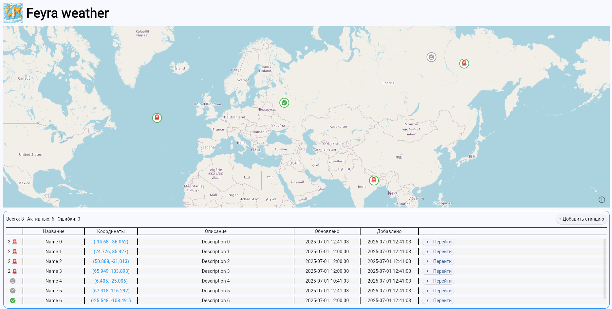
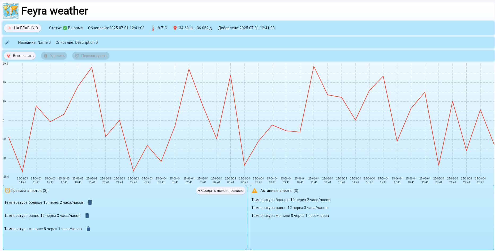

# Feyra WeatherAi WebDashboard (alpha 0.1, python 3.9)
## Описание
Feyra WeatherAi WebDashboard — это веб-дашборд для управления виртуальными метеостанциями. Система предназначена для визуализации данных с метеостанций, предсказания температуры на 28 дней с почасовой детализацией, анализа температурных трендов и оповещения о критических изменениях температуры. Имеет клиент-серверную архитектуру (FastAPI + Flet).

## Скриншоты
Главная страница

Страница станции

## Функционал
- Интерактивная карта метеостанций с визуализацией статусов
- Управление метеостанциями (включение/выключение, добавление, удаление, редактирование, перезагрузка)
- Управления алертами (настраиваемый триггер на определенную температуру в определенный период) на метеостанции (добавлени и удаление)
- Фоновая поддержка актуальных данных
- Собственная PyTorch нейросеть

## Важно
- Это первая версия данного проекта, могут быть многочисленные ошибки. Тестирование проводилось только по основным сценариям.
- Используется Free версия open-meteo API, просьба почитать условия [тут](https://open-meteo.com/en/terms)
- Нейронная сеть сейчас находится в альфа версии, обучена только на одном регионе (Москва). Другие регионы могут предсказываться некорректно.
