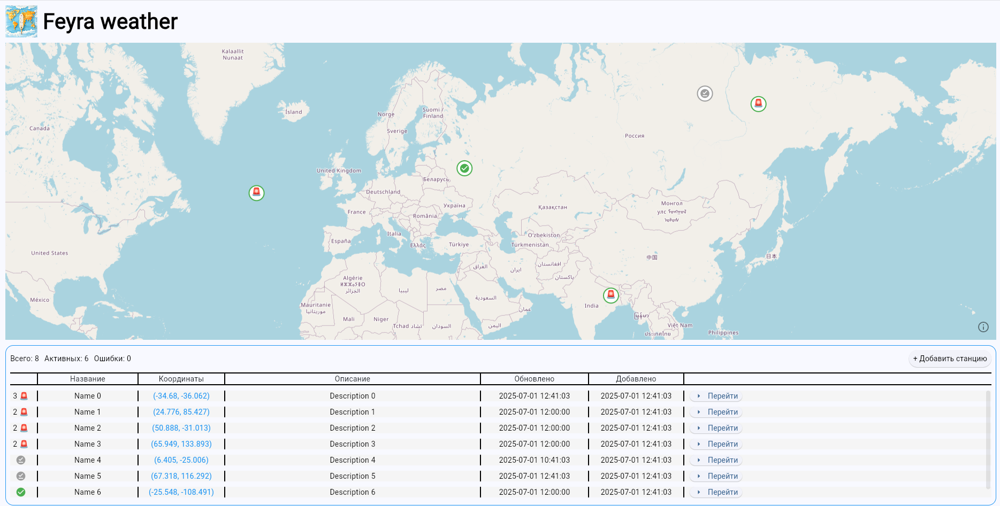
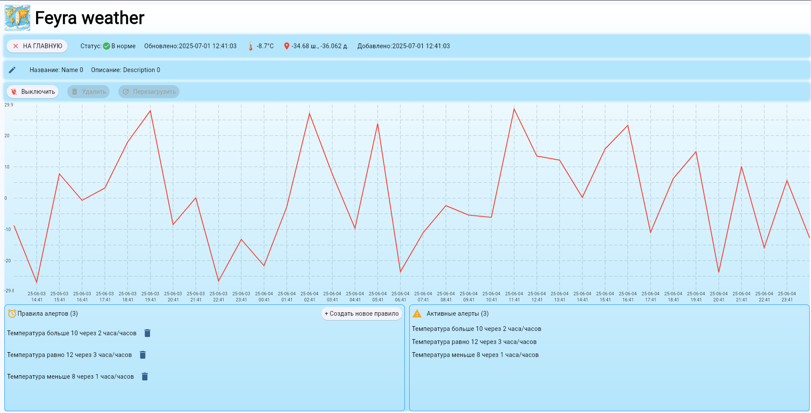

# Feyra WeatherAi WebDashboard (alpha 0.2, python 3.9)
## Описание
Feyra WeatherAi WebDashboard — это веб-дашборд для управления виртуальными метеостанциями. Система предназначена для визуализации данных, предсказания температуры на 28 дней с почасовой детализацией, анализа температурных трендов и оповещения о критических изменениях температуры. Имеет клиент-серверную архитектуру (FastAPI + Flet).

## Скриншоты
Главная страница

Страница станции

## Функционал
- Интерактивная карта виртуальных метеостанций с визуализацией статусов;
- Управление виртуальными метеостанциями (включение/выключение, добавление, удаление, редактирование, перезагрузка);
- Управления алертами (настраиваемый триггер на определенную температуру в определенный период) на метеостанции (добавлени и удаление);
- Фоновая поддержка актуальных данных;
- Собственная PyTorch нейросеть с возможностью обучения.

## Update 0.2:
- Переписан код инференса модели;
- Добавлена возможность самостоятельно обучать модель;
- Незначительные изменения в других модулях.

## Next update:
- Переработка и оптимизация взаимодействия с базой данных
- Рефакторинг кода бекенд приложения
- Фикс багов (при наличии)

## Важно
- Это альфа версия данного проекта, могут быть многочисленные ошибки. Тестирование проводилось только по основным сценариям.
- Нейронная сеть сейчас находится в альфа версии, обучалась недолго.